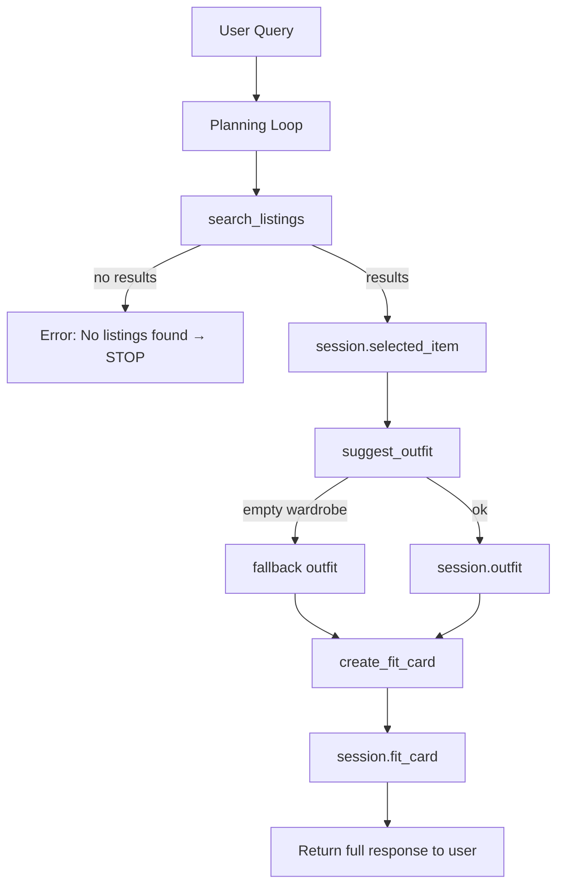

# FitFindr — planning.md

> Complete this document before writing any implementation code.
> Your spec and agent diagram are what you'll use to direct AI tools (Claude, Copilot, etc.) to generate your implementation — the more specific they are, the more useful the generated code will be.
> Your planning.md will be reviewed as part of your submission.
> Update it before starting any stretch features.

---

## Tools

List every tool your agent will use. For each tool, fill in all four fields.
You must have at least 3 tools. The three required tools are listed — add any additional tools below them.

### Tool 1: search_listings

**What it does:**
<!-- Describe what this tool does in 1–2 sentences -->
Searches a dataset of thrift clothing listings and returns items that match a user's description, size, and maximum price. It filters and ranks results so the most relevant items appear first.

**Input parameters:**
<!-- List each parameter, its type, and what it represents -->
- `description` (str): Natural language description of what the user wants (e.g. "vintage graphic tee")
- `size` (str | None): Clothing size filter (e.g. "M"); if None, ignore size filtering
- `max_price` (float): Maximum price the user is willing to pay

**What it returns:**
<!-- Describe the return value — what fields does a result contain? -->
A list of matching listing dictionaries, each containing: id, title, description, category, style_tags, size, condition, price, colors, brand, and platform. Results are sorted by relevance (matching tags + description similarity + price closeness)

**What happens if it fails or returns nothing:**
<!-- What should the agent do if no listings match? -->
If no listings match, return an empty list []. The agent must immediately stop the workflow, set session["error"] = "No matching listings found", and return a user message suggesting they broaden size, price, or description. 

---

### Tool 2: suggest_outfit

**What it does:**
<!-- Describe what this tool does in 1–2 sentences -->
Generates outfit recommendations by combining a newly selected thrift item with the user's existing wardrobe.

**Input parameters:**
<!-- List each parameter, its type, and what it represents -->
- `new_item` (dict): A selected listing from search_listings
- `wardrobe` (dict): User's wardrobe containing a list of owned clothing items

**What it returns:**
<!-- Describe the return value -->
A string describing 1-3 outfit combinations. Each should include: how to style the new item, which wardrobe pieces it pairs with, and optional aeshetic/style description. 
Example Output: Pair the graphic tee with baggy light-wash jeans and chunky sneakers for a relaxed streetwear look. Layer with an oversized hoodie for colder days.

**What happens if it fails or returns nothing:**
<!-- What should the agent do if the wardrobe is empty or no outfit can be suggested? -->
If wardrobe["items"] is empty or missing, return general styling advice for the new item instead of crashing. The agent should still proceed to create_fit_card, using a fallback outfit string like "Styled as a standalone statement piece with versatile layering options". 

---

### Tool 3: create_fit_card

**What it does:**
<!-- Describe what this tool does in 1–2 sentences -->
Converts an outfit description into a short, aesthetic, social-media-style caption suitable for sharing (Instagram & Tiktok vibes).

**Input parameters:**
<!-- List each parameter, its type, and what it represents -->
- `outfit` (str): Outfit description generated by suggest outfit
- `new_item` (dict): The selected listing item

**What it returns:**
<!-- Describe the return value -->
A single string caption that feels casual, trendy, and personal (not formal or descriptive)
Example: "found this faded band tee for $22 and it's already my new favorite fit! baggy jeans season forever"

**What happens if it fails or returns nothing:**
<!-- What should the agent do if the outfit data is incomplete? -->
If outfit is empty or invalid, return: "Unable to generate fit card because outfit information is missing. Try generating an outfit first" (should not crash or return None).

---

### Additional Tools (if any)

<!-- Copy the block above for any tools beyond the required three -->

---

## Planning Loop

**How does your agent decide which tool to call next?**
<!-- Describe the logic your planning loop uses. What does it look at? What conditions change its behavior? How does it know when it's done? -->
The agent follows a strict sequential pipeline with conditional branching:
1. Parse user query into:
   - description
   - size (if present)
   - max_price (if present)
2. Call search_listings(description, size, max_price)
3. If results list is empty:
   - set session["error"] = "No listings found"
   - set session["selected_item"] = None
   - Return early to user with suggestion to broaden filters
   - Stop execution
4. Else: 
   - set session["selected_item"] = result[0]
5. Call suggest_outfit(selected_item, wardrobe)
6. If wardrobe is empty:
   - set session["outfit"] = fallback style message
   - continue (do not stop)
7. Else:
   - set session["outfit"] = returned outfit string
8. Call create_fit_card(session["outfit"], selected_item)
9. Store results in:
   - session["fit_card"]
10. Return full session state to UI

The loop is linear but conditional at step 3 and step 6, so that it isn't blindly calling all tools.

---

## State Management

**How does information from one tool get passed to the next?**
<!-- Describe how your agent stores and accesses state within a session. What data is tracked? How is it passed between tool calls? -->
The agent maintains a session dictionary that persists across tool calls within a single interaction. 

Stored values:
- session["selected_item"]: result from search_listings
- session["outfit"]: output from suggest_outfit
- session["fit_card"]: output from create_fit_card
- session["error"]: any failure message from search step

Each tool reads from and writes to this shared session object. This ensures downstream tools do not need to recompute or re-parse earlier outputs. 

---

## Error Handling

For each tool, describe the specific failure mode you're handling and what the agent does in response.

| Tool | Failure mode | Agent response |
|------|-------------|----------------|
| search_listings | No results match the query | Stop pipeline, set error message, ask user to broaden filters (size/price/description) |
| suggest_outfit | Wardrobe is empty | Use fallback styling description and continue to fit card generation |
| create_fit_card | Outfit input is missing or incomplete | Return user-friendly error string and skip generation|

---

## Architecture

<!-- Draw a diagram of your agent showing how the components connect:
     User input → Planning Loop → Tools (search_listings, suggest_outfit, create_fit_card)
                                                                          ↕
                                                                   State / Session
     Show what triggers each tool, how state flows between them, and where error paths branch off.
     ASCII art, a Mermaid diagram (https://mermaid.js.org/syntax/flowchart.html), or an embedded
     sketch are all fine. You'll share this diagram with an AI tool when asking it to implement
     the planning loop and each individual tool. -->

---

## AI Tool Plan

<!-- For each part of the implementation below, describe:
     - Which AI tool you plan to use (Claude, Copilot, ChatGPT, etc.)
     - What you'll give it as input (which sections of this planning.md, your agent diagram)
     - What you expect it to produce
     - How you'll verify the output matches your spec before moving on

     "I'll use AI to help me code" is not a plan.
     "I'll give Claude my Tool 1 spec (inputs, return value, failure mode) and ask it to implement
     search_listings() using load_listings() from the data loader — then test it against 3 queries
     before trusting it" is a plan. -->

**Milestone 3 — Individual tool implementations:**

I will use ChatGPT and/or Claude (alternating as needed) to implement each tool one at a time. 

For each tool: 
- I will provide the full tool specification from planning.md (inputs, outputs, failure conditions)
- I will also provide the starter function signature from tools.py
- I will request a direct implementation using load_listings() and/or Groq API where needed

Verification Steps:
- I will manually test each function with 2-3 sample inputs
- I will confirm: 
   - search_listings return filtered, non-empty lists when expected
   - suggest_outfit does not crash on empty wardrobes
   - create_fit_card produces varied outputs and handles empty input safely

**Milestone 4 — Planning loop and state management:**
I will use ChatGPT or Claude to help translate my planning.md loop and architecture diagram into agent.py logic. 

Input to AI:
- Planning Loop section (full conditional logic)
- Architecture diagram
- State Management section

Expected Output:
- A working run_agent() function with proper branching logic
- Correct session dictionary updates
- No unconditional tool execution

Verification:
- I will run at least 3 test cases:
   1. Normal flow (all tools succceed)
   2. No search results (early exit)
   3. Empty wardrobe (fallback outfit path)

I will confirm that:
- suggest_outfit is not called when search_listings fails
- session state updates correctly between steps

---

## A Complete Interaction (Step by Step)

FitFindr takes a user's thrift-related request and first searches a dataset of clothing listings using filters like description, size, and price. If matching items are found, it selects the best result and uses the user's wardrobe to generate outfit combinations, then converts the outfit into a short social-media-style fit caption. If any step returns no usable data (e.g., no listings found or missing outfit information), the process stops early and returns a helpful message instead of continuing the pipeline.

Write out what a full user interaction looks like from start to finish — tool call by tool call. Use a specific example query.

**Example user query:** "I'm looking for a vintage graphic tee under $30. I mostly wear baggy jeans and chunky sneakers. What's out there and how would I style it?"

**Step 1:**
<!-- What does the agent do first? Which tool is called? With what input? -->
User asks for vintage graphic tee under $30, size M. 

Agent calls: search listings("vintage graphic tee", size="M", max_price=30)

The agent returns the top result: "Faded Band Tee-$22"

**Step 2:**
<!-- What happens next? What was returned from step 1? What tool is called now? -->
Agent stores: selected_item = Faded Band Tee

The agent then calls suggest_outfit(selected_item, wardrobe) and returns "Pair with baggy jeans and chunky sneakers...". 

**Step 3:**
<!-- Continue until the full interaction is complete -->
Agent calls create_fit_card(outfit, selected ites) and returns "found this faded band tee for $22 and it's already my new favorite fit". 

**Final output to user:**
<!-- What does the user actually see at the end? -->
A structured response containing: 
- Selected item
- Outfit suggestion
- Fit card caption

